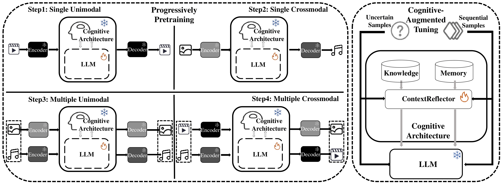
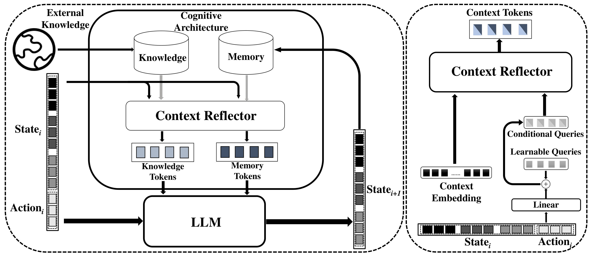
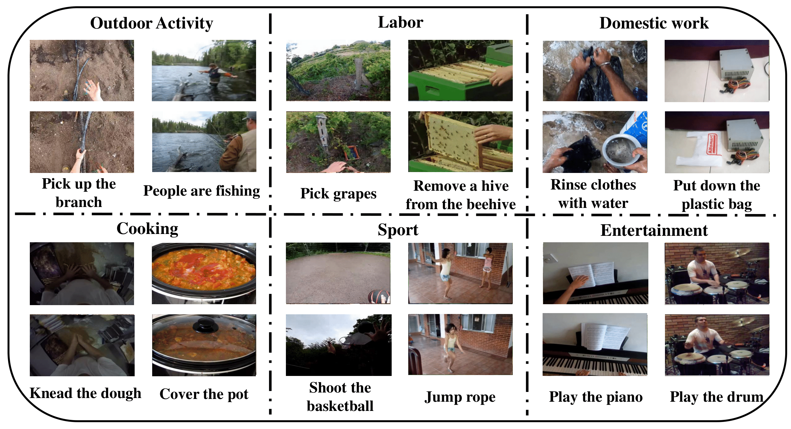
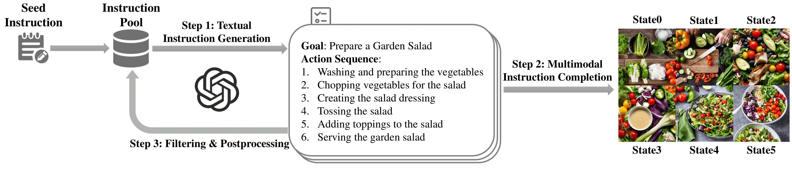

<h1 align = "center">
WorldGPT: Empowering LLM as Multimodal World Model
</h1>

<div align="center">
Zhiqi Ge*, Hongzhe Huang*, Mingze Zhou*,

Juncheng Li<sup>&dagger;</sup>, Guoming Wang, Siliang Tang, Yueting Zhuang

Zhejiang University

\*Equal Contribution. <sup>&dagger;</sup>Corresponding Authors


**MM 2024, Oral (Top 4%)**

<a href='https://arxiv.org/abs/2404.18202'></a> 


</div>

## Highlights

### Development of a Generalist World Model

We propose **WorldGPT**, a generalist world model trained on millions of videos through a **progressive state transition training** process, which naturally supports input and output across any combination of modalities.



### Novel Cognitive Architecture

We introduce a novel **cognitive architecture** tailored for world models, encompassing memory offloading, knowledge retrieval, and **ContextReflector**. We construct high-quality sequential samples and retrieval-augmented samples to teach WorldGPT to utilize information from retrieved context through the **cognitive-augmented tuning** process.



### Construction of World State Transitions Dataset

We present **WorldNet**, a comprehensive dataset for world state transitions, ideal for training and evaluating world models.



### Novel Learning Paradigm for Multimodal Agents

We explore a new learning paradigm wherein multimodal agents can efficiently acquire knowledge from WorldGPT through **dream tuning** on synthesized data.



## Getting Started

### Installation

#### 1. Prepare Environment

First clone our repository, and create a python environment via the following commands:

```
git clone
cd WorldGPT
conda env create -f environment.yaml
conda activate worldgpt
```

#### 2. Prepare Pretrained Weights

WorldGPT is based on following existing models. Please download the corresponding weights following the instructions:

* `Vicuna`:  WorldGPT employs `Vicuna V0 7B` as the language decoder. Prepare the full pretrained weights following the [official instructions](https://huggingface.co/lmsys/vicuna-7b-delta-v0). Then, set the variable *vicuna_path* in the [base config](config/base.yaml#L8) at Line 8.
* `LanguageBind` is the unified image/video/audio encoder. The model version for each modality is listed as follows:

  | image                                                                     | video                                                                                     | audio                                                                           |
  | ------------------------------------------------------------------------- | ----------------------------------------------------------------------------------------- | ------------------------------------------------------------------------------- |
  | [LanguageBind_Image](https://huggingface.co/LanguageBind/LanguageBind_Image) | [LanguageBind_Video_V1.5_FT](https://huggingface.co/LanguageBind/LanguageBind_Video_V1.5_FT) | [LanguageBind_Audio_FT](https://huggingface.co/LanguageBind/LanguageBind_Audio_FT) |

  The weights are automatically downloaded by default. For manual downloaded weights or customed model versions, set the variable *languagebind_path* in the [base config](config/base.yaml#L13) at Line 13 - 16.
* `Diffusion Models` are used to generate image/video/audio outputs (if generation is enabled). The model for each modality is listed as follows:

  | image                                                                       | video                                                                | audio                                                        |
  | --------------------------------------------------------------------------- | -------------------------------------------------------------------- | ------------------------------------------------------------ |
  | [stable-diffusion-v1-5](https://huggingface.co/runwayml/stable-diffusion-v1-5) | [zeroscope_v2_576w](https://huggingface.co/cerspense/zeroscope_v2_576w) | [audioldm-l-full](https://huggingface.co/cvssp/audioldm-l-full) |

  The weights are automatically downloaded by default. For manual downloaded weights or customed model versions, set the variable *decoder_path* in the [base config](config/base.yaml#L9) at Line 9 - 12.

#### 3. Prepare WorldGPT Checkpoints

Choose a pretrained checkpoint from the versions below:

| version                          | link                                                                                             |
| -------------------------------- | ------------------------------------------------------------------------------------------------ |
| worldgpt-languagebind-image      | [download](https://drive.google.com/drive/folders/1evhqNfhndxXRN0vx5xcbHkoesRptRLO-?usp=drive_link) |
| worldgpt-languagebind-multimodal | [download](https://drive.google.com/drive/folders/1T-Wp_BIwUjhqahVS1e0FCitsOnudLLTc?usp=drive_link) |
| worldgpt-decode-image            | [download](https://drive.google.com/drive/folders/13C8NZzW0FZmcguHZzAAw94k_3BRmzIdq?usp=drive_link) |
| worldgpt-decode-multimodal       | [download](https://drive.google.com/drive/folders/16Q5j4b7Ssj1t_H9B4T-XeURSYaECujgJ?usp=drive_link) |

Note that WorldGPT uses worldgpt-languagebind checkpoints by default, which output LanguageBind embeddings. Though we provide worldgpt-decode checkpoints for visualization, they do not accurately reflect the true model capabilities.

### Training

#### 1. Prepare Datasets

##### 1.1. WorldNet

We collect state transition datasets from various source and construct a comprehensive dataset named **WorldNet**. WorldNet consists of two subsets: WorldNet-Wild and WorldNet-Crafted. Each dataset is further split into subsets by the data source. The available modalities of each subset are listed as follows. The WorldNet-Crafted subset can be downloaded [here](https://drive.google.com/drive/folders/1hntZ8Q4GQg5Esq2q5EBStvAEs_tqVxW_?usp=drive_link).

<table>
	<tr>
		<th>Subset</th>
		<th>Source</th>
		<th>Modality</th>
	</tr>
	<tr>
		<td rowspan="2">WorldNet-Wild</td>
		<td>YT-Temporal-180M</td>
		<td>image, video,audio</td>
	</tr>
	<tr>
		<td>HowTo100M</td>
		<td>image, video, audio</td>
	</tr>
	<tr>
		<td rowspan="5">WorldNet-Crafted</td>
		<td>Charades</td>
		<td>image, video, audio</td>
	</tr>
	<tr>
		<td>AVQA</td>
		<td>image, video, audio</td>
	</tr>
	<tr>
		<td>Ego4D</td>
		<td>image, video, audio</td>
	</tr>
	<tr>
		<td>Something-Something V2</td>
		<td>image</td>
	</tr>
	<tr>
		<td>YouCook2</td>
		<td>image, video</td>
	</tr>
</table>

The downloaded dataset contains only data of original modalities. For faster training, please precompute the LanguageBind embeddings via the command:

```
python preprocess.py --data_root path/to/subset/modality/Train --modality image/video/audio --languagebind_path path/to/languagebind/weights
```

With the data prepared, organize each subset as the structure below:

```
└── ag/avqa/ego4d/s2s/youcook
    └── image/video/audio
        ├── Train
        └── Train_pt
```

In the directory of each modaltity, `Train` contains raw data, and `Train_pt` contains corresponding precomputed LanguageBind embeddings.

Finally, specify the dataset path in the [training config]() via *dataset_list* variable. Here is an example:

```
dataset_list:
  -
    root: worldnet/ag                                    # root of subset
    annotaion_path: worldnet/ag/state/action_train.json  # path to annotations
    modality: ['image', 'video', 'audio']                # available modalities of subset
    weight: 0.2                                          # possibility to be chosen in training
  ...
```

Additionally, set variable *precomputed_languagebind* to `True` if precomputed LanguageBind embeddings are available.

##### 1.2. Custom Dataset

For training on custom dataset, first convert the annotas into the WorldNet format. Here is an example:

```
[
  {
    "state0": {
      "video": "00001_state0.mp4",
      "audio": "00001_state0.wav",
      "image": "00001_state0.jpg",
      "text": ""
    },
    "state1": {
      "video": "00001_state1.mp4",
      "audio": "00001_state1.wav",
      "image": "00001_state1.jpg",
      "text": ""
    },
    "action": {
      "text": "adjust the mold"
    },
  },
  ...
]
```

Only `.jpg` for image, `.mp4` for video, `.wav` for audio are valid data formats. Use an empty string to mark a missing modality. Then, you can follow the same steps as WorldNet to run on your custom dataset.

#### 2. Start Training

Before starting training, first check the [base config](config/base.yaml), [training config](config/train.yaml) and [deepspeed config](config/ds_base.json) for detailed settings.

For quick starting, run the script:

```
bash scripts/train.sh
```

Specifying the command:

```
deepspeed --master_addr 127.0.0.1 --master_port 28459 train.py \
    --cfg_path config/train.yaml \
    --save_path ckpt/worldgpt \
    --load_path /path/to/worldgpt-languagebind-ckpt
```

### Inference

#### 1. LanguageBind Inference

Before starting inference, check the [config](config/test.yaml) for detailed settings, and set *load_path* to the worldgpt-languagebind checkpoint.

For inference with LanguageBind outputs:

```python
import torch
import torch.nn.functional as F

from model.worldgpt import load_worldgpt_model
from model.preprocessor import PreProcessor
from dataset.utils import to
from config import load_config

if __name__ == '__main__':
    _args = {'mode': 'test', 'dtype': torch.float16, 'preprocess_modality': ['video', 'audio'], 'cfg_path': 'config/test.yaml'}
    args = load_config(_args)
    args.update(_args)

    model = load_worldgpt_model(**args)
    model = model.eval().to('cuda', dtype=args['dtype'])

    preprocessor = PreProcessor(args)
    preprocessor.to_('cuda', dtype=args['dtype'])

    video = ['demo/languagebind/skiing/video/state0.mp4', 'demo/languagebind/aircraft/video/state0.mp4']
    audio = ['demo/languagebind/skiing/audio/state0.wav', 'demo/languagebind/aircraft/audio/state0.wav']
    action = ['In the video, the person is skiing.', 'The aircraft starts to spray water over the forest.']
    inputs, _ = preprocessor({'video': video, 'audio': audio, 'text': action})
    target_modality = ['video', 'audio']

    with torch.no_grad():
        pred = model.generate(inputs, target_modality,
                              max_tgt_length=args['max_tgt_length'], top_p=args['top_p'],
                              temperature=args['temperature'])
        to(pred, 'cpu', dtype=torch.float)

    video_targets = ['demo/languagebind/skiing/video/state1.mp4', 'demo/languagebind/aircraft/video/state1.mp4']
    audio_targets = ['demo/languagebind/skiing/audio/state1.wav', 'demo/languagebind/aircraft/audio/state1.wav']
    targets, _ = preprocessor({'video': video_targets, 'audio': audio_targets})
    for m in pred:
        targets[m] = targets[m].to('cpu', dtype=torch.float)
        print(m, F.cosine_similarity(pred[m], targets[m], dim=1))
```

Alternatively, use precomputed LanguageBind embeddings inputs:

```python
import torch
import torch.nn.functional as F

from model.worldgpt import load_worldgpt_model
from dataset.utils import to
from config import load_config

if __name__ == '__main__':
    _args = {'mode': 'test', 'dtype': torch.float16, 'cfg_path': 'config/test.yaml'}
    args = load_config(_args)
    args.update(_args)

    model = load_worldgpt_model(**args)
    model = model.eval().to('cuda', dtype=args['dtype'])

    video = ['demo/languagebind/skiing/video/state0.pt', 'demo/languagebind/aircraft/video/state0.pt']
    audio = ['demo/languagebind/skiing/audio/state0.pt', 'demo/languagebind/aircraft/audio/state0.pt']
    action = ['In the video, the person is skiing.', 'The aircraft starts to spray water over the forest.']
    target_modality = ['video', 'audio']

    video = torch.stack([torch.load(p) for p in video]).to('cuda', dtype=args['dtype'])
    audio = torch.stack([torch.load(p) for p in audio]).to('cuda', dtype=args['dtype'])
    inputs = {'video': video, 'audio': audio, 'text': action}

    with torch.no_grad():
        pred = model.generate(inputs, target_modality,
                              max_tgt_length=args['max_tgt_length'], top_p=args['top_p'],
                              temperature=args['temperature'])
        to(pred, 'cpu', dtype=torch.float)

    video_targets = ['demo/languagebind/skiing/video/state1.pt', 'demo/languagebind/aircraft/video/state1.pt']
    audio_targets = ['demo/languagebind/skiing/audio/state1.pt', 'demo/languagebind/aircraft/audio/state1.pt']
    video_targets = torch.stack([torch.load(p) for p in video_targets])
    audio_targets = torch.stack([torch.load(p) for p in audio_targets])
    targets = {'video': video_targets, 'audio': audio_targets}
    for m in pred:
        print(m, F.cosine_similarity(pred[m], targets[m], dim=1))
```

We also provide a script for batch inference. First prepare your input data following instructions in [Prepare Datasets](#1-prepare-datasets), and specify the dataset and input/target modalities in the [config](config/batch_inference.yaml). Then run the command to start inference:

```
python batch_inference.py
```

#### 2. Visualized Inference

We provide the worldgpt-decode checkpoints for visualized inference. See [visualized_inference.ipynb](visualized_inference.ipynb) for details.

## Citation

If you found this work useful, please consider giving this repository a star and citing our paper as followed:

```bibtex
@misc{ge2024worldgpt,
      title={WorldGPT: Empowering LLM as Multimodal World Model}, 
      author={Zhiqi Ge and Hongzhe Huang and Mingze Zhou and Juncheng Li and Guoming Wang and Siliang Tang and Yueting Zhuang},
      year={2024},
      eprint={2404.18202},
      archivePrefix={arXiv},
      primaryClass={cs.AI}
}
```

## Acknowledgment

Our project is developed based on the following repositories:

* [NExT-GPT](https://github.com/NExT-GPT/NExT-GPT): Any-to-Any Multimodal Large Language Model

* [LanguageBind](https://github.com/PKU-YuanGroup/LanguageBind): Extending Video-Language Pretraining to N-modality by Language-based Semantic Alignment

## License

This repository is under [BSD 3-Clause License](https://github.com/DCDmllm/WorldGPT/blob/main/license.md).

## Contact

If you have any question about our work, please feel free to contact [Hongzhe Huang](mailto:22321202@zju.edu.cn) and [Zhiqi Ge](mailto:zhiqige2000@gmail.com).
